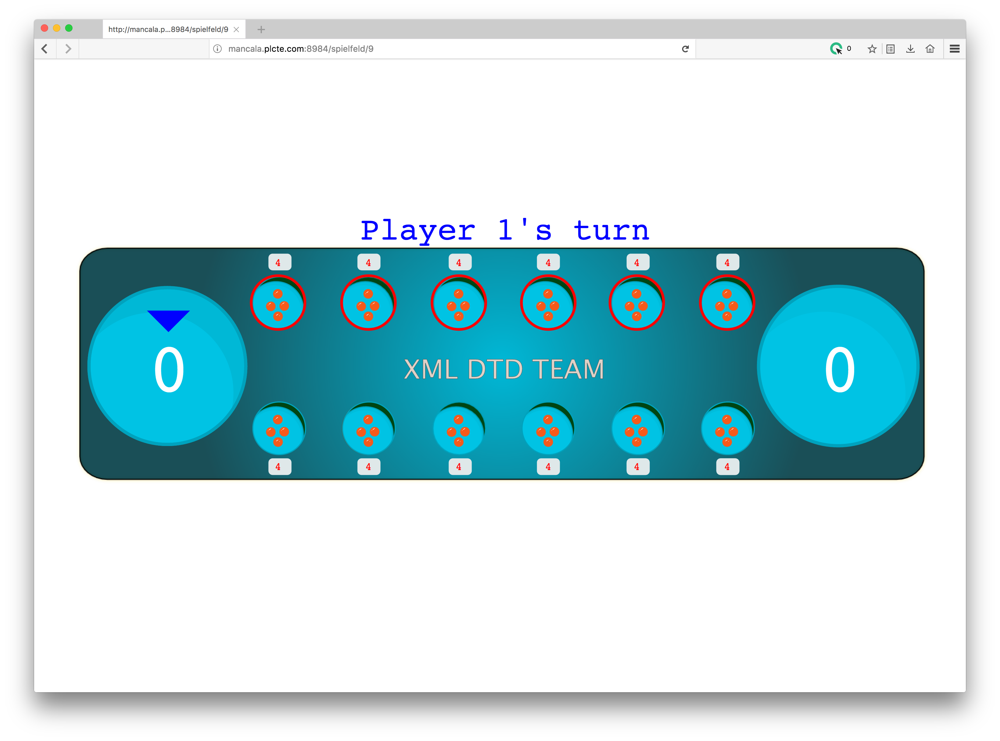

<h1> Mancala Brettspiel im Rahmen von XML Praktikum - TUM </h1>
Mancala ist ein antikes Brettspiel, welches in verschiedenen Varianten gespielt wird. Dieses "Zähl- und-Fang" Spiel wird von zwei Spielern gespielt, wobei das Ziel ist, die meisten Steine im eigenen Haus zu sammeln. Im Rahmen des Praktikums XML-Technologien im WS 2016/17 entwickelt das Team "XML-DTD" dieses Spiel unter Einsatz des XML Stacks.

